# 🚀 VSD-Squadron RTL2GDSII SOC Implementation 

## WEEK-1


<details>
<summary><strong>Phase 1 — OpenLANE Flow Familiarity </strong></summary>

--- 

<details>
  <summary>1.1. Theory</summary>

## SoC Design Using OpenLane

This repository documents my hands-on implementation of the complete **RTL to GDSII ASIC design flow** using OpenLANE.

---

## 1. Digital ASIC Design

Digital ASIC design is the process of converting a hardware description (RTL) into a fabricated silicon chip (ASIC).

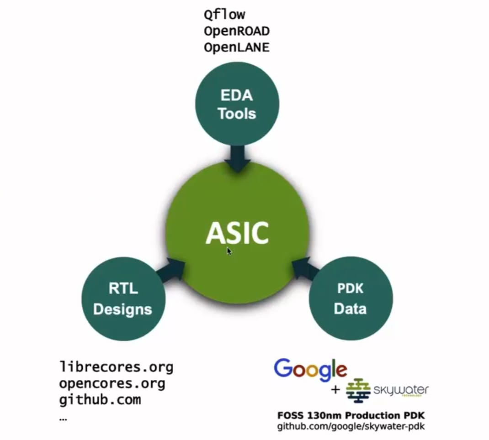

Traditionally, ASIC design flow required:

- EDA Tools
- PDK Data
- Standard Cell Libraries

These together enable the transformation of RTL → ASIC.

---

## 2. Open-Source Digital ASIC Design

In open-source ASIC design:

- EDA tools are open-source
- RTL design is written in HDL (Verilog/VHDL)
- Standard cell libraries are publicly available
- Open PDKs are used

OpenLane integrates:

- Open-source EDA tools
- Open PDK
- Automated flow

And produces:

RTL → GDSII (layout ready for fabrication)

---

### What is a PDK?

PDK = Process Design Kit

A PDK is a collection of files used to model the fabrication process for EDA tools while designing an IC.

It allows designers to create layouts that match actual manufacturing rules.

---

### Contents of a PDK

A PDK typically contains:

- Process Design Rules (DRC rules)
- LVS rules
- PEX rules
- Device Models
- Digital Standard Cell Libraries
- I/O Libraries

These ensure that the design matches the real manufacturing process.

---

### Evolution of IC Design and PDK Usage

In earlier days:

- Chip design was tightly integrated with fabrication.
- Each company (e.g., Intel) controlled manufacturing.
- Designers and fabrication teams worked under the same organization.

These companies controlled:

- Process technology
- Design methodology
- Manufacturing flow

Later:

- Fabless design companies emerged.
- Foundries handled fabrication.
- Designers needed a standardized interface to fabrication.

To separate design from fabrication:

Process Design Kits (PDKs) were introduced.

PDKs standardized the interaction between:

Design team ↔ Manufacturing process

---

## 5. Open PDK

Open PDK used:

- License: Apache 2.0
- Collaboration between Google and SkyWater Technology

FOSS 130nm Production PDK:

Available at:
github.com/google/skywater-pdk

---

### Is 130nm Fast?

Yes.

Example reference:

Intel Pentium 4 Extreme Edition
3.46 GHz (Quad-core era reference)

Even 130nm technology was capable of high-performance designs.


---

## Openlane ASIC Flow


Goal:
- ✅ Clean GDSII
- ✅ Zero DRC
- ✅ Zero LVS mismatch
- ✅ Timing Clean Design

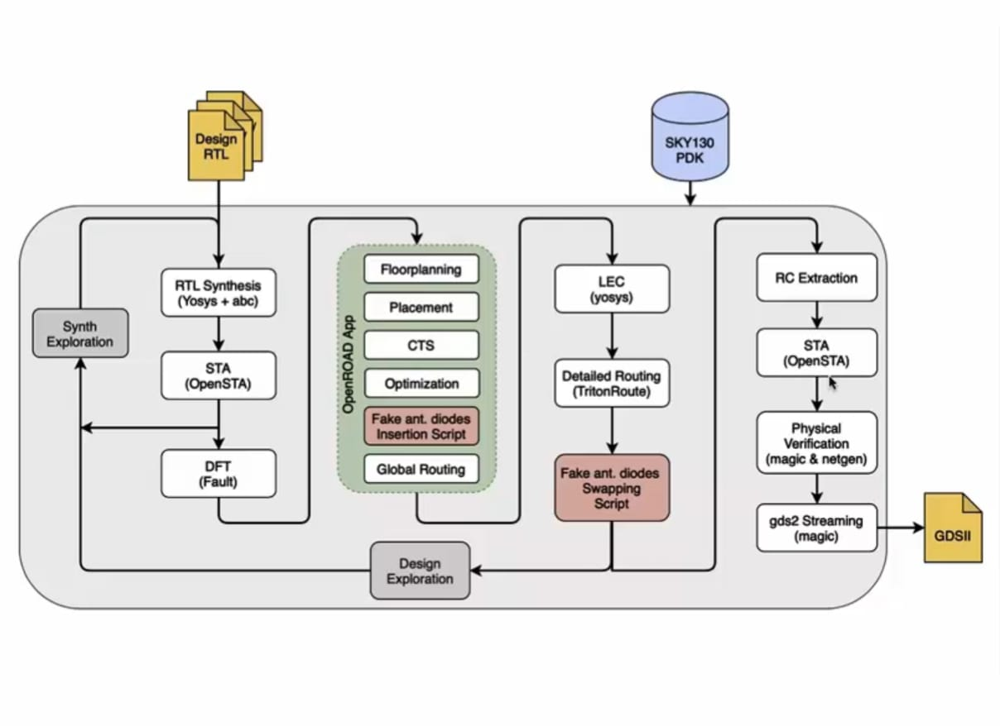

---

## 1. RTL Synthesis

### Description
- Converts RTL (Verilog) into a gate-level netlist  
- Maps logic to Standard Cell Library (Sky130 SCL)  
- Performs logic optimization  

### Tool Used
- Yosys (via OpenLANE)

### Output
- Gate-level netlist


---

## 2) Floorplanning

### Description
- Defines die & core area  
- IO placement  
- Power planning  
- Macro placement (if any)

### Objective
- Efficient silicon usage  
- Proper power distribution  
- Low congestion  


---

## 3. Placement

### Steps
- Global Placement  
- Detailed Placement  
- Post-placement Optimization  

### Goals
- Minimize wirelength  
- Improve timing slack  
- Reduce congestion  

---

## 4. Clock Tree Synthesis (CTS)

### Description
- Builds clock distribution network  
- Inserts buffers  
- Minimizes clock skew  

### Objective
Stable clock delivery to all sequential elements.


---

## 5. Routing

### Steps
- Global Routing  
- Detailed Routing  

### Handles
- Congestion  
- Antenna violations  
- Wire optimization  

---


## 6. Signoff Verification

### Physical Verification
- DRC – Magic  
- LVS – Magic + Netgen  

### Timing Verification
- STA – OpenSTA  

### Parasitic Extraction
- RC Extraction – Magic  


---
###  OpenLane Regression Testing

The design exploration utility is used for regression testing.

Regression testing means:

- Running automation on multiple designs
- Comparing results with previously known correct results
- Ensuring no functionality breaks

This ensures flow stability.

---

###  Design For Test (DFT)

DFT techniques improve testability of a chip.

Includes:

- Scan Insertion
- Automatic Test Pattern Generation (ATPG)
- Test Pattern Compression
- Fault Coverage
- Fault Simulation

These techniques ensure high manufacturing test quality.

---

###  Physical Implementation (Automated Place & Route)

Also called:

Automated PnR (Place and Route)

Steps include:

1. Floorplanning (includes power planning)
2. End Decoupling Capacitors & Tap Cell Insertion
3. Placement (Global & Detailed)
4. Post-Placement Optimization
5. Clock Tree Synthesis (CTS)
6. Routing (Global & Detailed)

This converts logical netlist into physical layout.

---

###  Logic Equivalence Check (LEC)

Every time the netlist is modified, verification must be performed.

Why?

Because:

- CTS modifies the netlist.
- Post-placement optimizations modify the netlist.
- Routing optimizations may affect structure.

LEC is used to formally confirm that:

The functionality has NOT changed after netlist modifications.

It ensures:

Original RTL ≡ Final netlist

---

###  Dealing with Antenna Rule Violations

When a metal wire segment is fabricated, it can act as an antenna.

During fabrication:

- Reactive ion etching causes charge accumulation on the wire.
- Accumulated charge can damage transistor gates.
- Gate oxide may break.

This is called an **Antenna Effect**.

---

### Two Solutions for Antenna Violations

1) Bridge the wire to a higher metal layer (by adding jump/bridge)

- Requires router awareness.

2) Add Antenna Diodes

- These leak away accumulated charge.
- Antenna diodes are provided by the Standard Cell Library (SCL).

---

###  Preventive Antenna Approach

Preventive method:

- Add a fake antenna diode near cell input after placement.
- Run antenna checks (Magic tool) on routed layout.
- If violation is detected on a cell input pin:
    Replace fake diode with real antenna diode.

This ensures safe fabrication.

---

###  Static Timing Analysis (STA)

After routing:

RC extraction is performed using:

- Def2Spef

Timing analysis is performed using:

- OpenSTA (via OpenROAD)

This ensures setup and hold timing constraints are satisfied.

---

###  Physical Verification (DRC & LVS)

Physical verification ensures manufacturability.

Includes:

1) DRC – Design Rule Check
2) LVS – Layout Versus Schematic


---
</details>

--- 

<details> 

<summary>1.2. LAB</summary>
  
### Determine Flip-flop Ratio

The task is to find the flip-flop ratio ratio for the design picorv32a. This is the ratio of the number of flip flops to the total number of cells.

1. Run OpenLANE:
   $ make mount  -  Opens the Docker container for the OpenLane environment

   % ./flow.tcl -interactive  -  Starts the OpenLane flow in interactive mode to execute the RTL to GDSII flow step-by-step

   % package require openlane 0.9  -  Loads the OpenLane v0.9 package and its required dependencies

2. prep -design picorv32a

The command:

    prep -design picorv32a

is used to initialize the OpenLane flow for the `picorv32a` design.

It performs the following tasks:
- Loads the RTL (Verilog) files
- Reads the `config.tcl` file
- Links the Sky130 standard cell library
- Applies clock and design constraints
- Creates a new `runs/` directory to store logs, reports, and results

This step must be executed before running synthesis or any physical design stage.

In simple words, `prep -design` prepares the environment for the ASIC design flow.

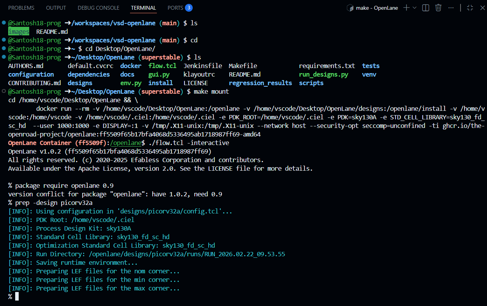

### 3. Run Synthesis
   When we run:

    run_synthesis

in the VSD Cloud OpenLane environment:

- The RTL (Verilog) code is converted into a gate-level netlist
- The design is mapped to Sky130 standard cells
- Logic optimization is performed to reduce area and improve timing
- Static Timing Analysis (STA) is executed
- Reports for cell count, area, and timing are generated

All results are stored inside:

    designs/picorv32a/runs/RUN_2026.02.22_09.53.55

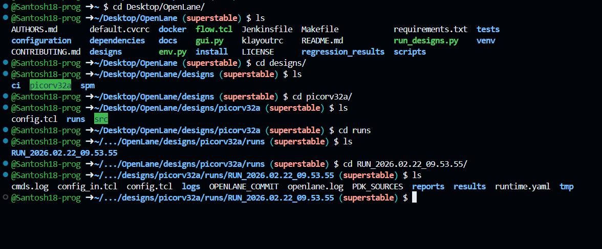
In simple words, run_synthesis converts RTL code into real standard cell logic and checks whether the design meets timing requirements.

### Synthesis Result : 


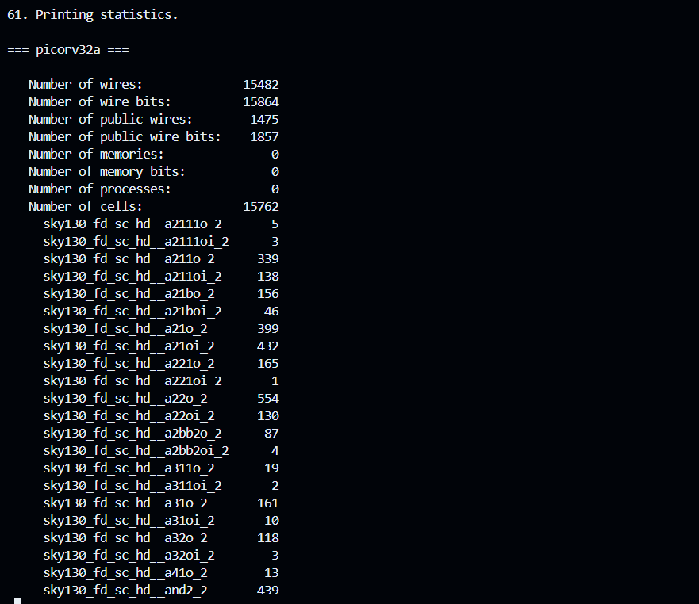
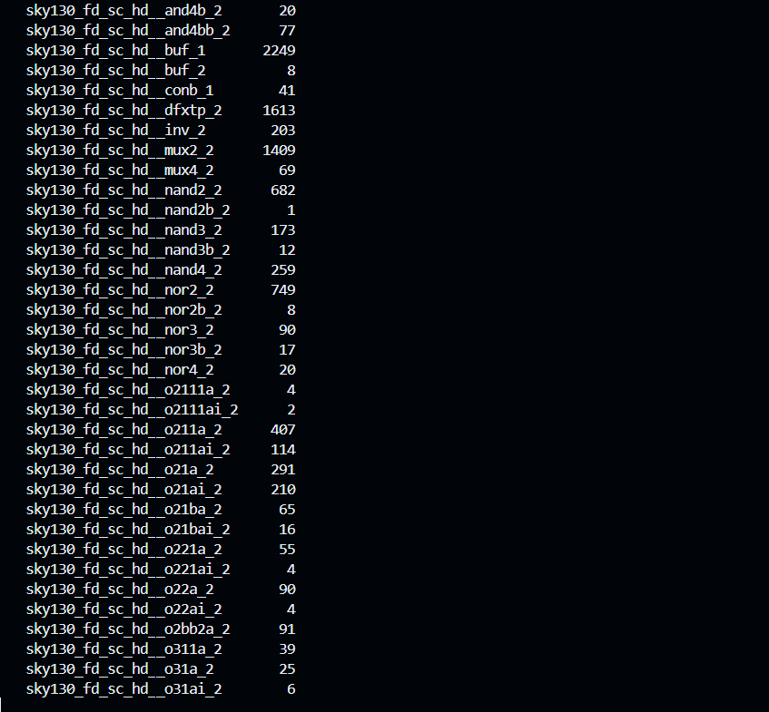
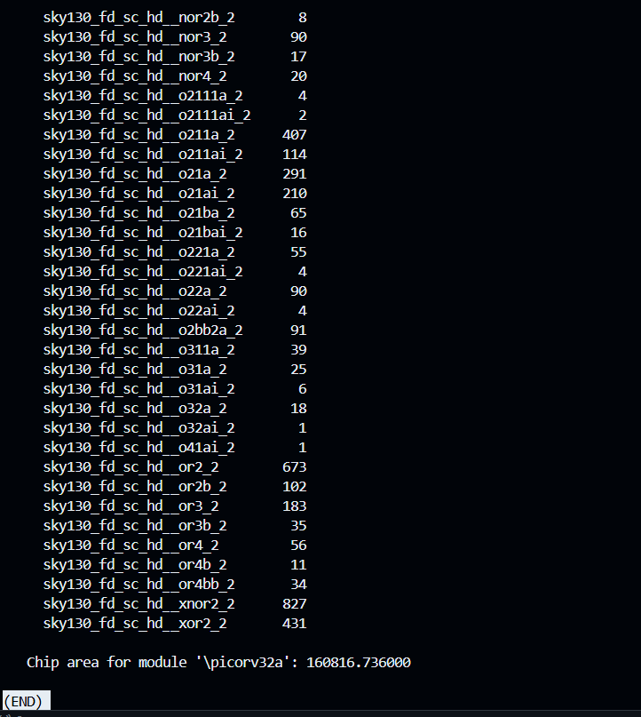

The flipflop ratio is (number of flip flops)/(total number of cells) is  (1613/15762) = 0.102334 = 10.2334%

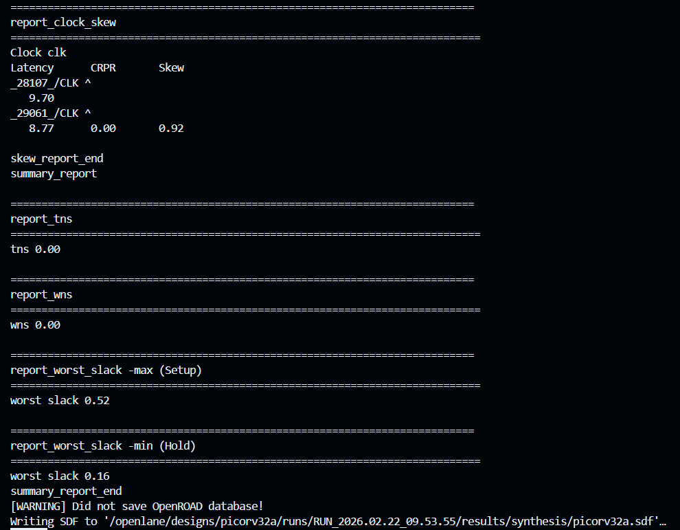

### Timing Report Explanation

The above timing report shows the synthesis stage timing analysis results.

- TNS (Total Negative Slack) = 0.00  
  This means there are no accumulated timing violations in the design.

- WNS (Worst Negative Slack) = 0.00  
  This indicates that the worst timing path does not violate the setup constraint.

- Worst Setup Slack = 0.52 ns  
  The data arrives 0.52 ns earlier than the required time.  
  This means setup timing is satisfied and the design has a positive timing margin.

- Worst Hold Slack = 0.16 ns  
  The data is stable for 0.16 ns after the clock edge.  
  This confirms that there are no hold violations.
  
</details>
</details>


<details>
<summary><strong>Phase 2 — Floorplan Fundamentals</strong></summary>

---

<details>
  <summary>2.1. Theory</summary>
  
## Floor Planning, Pre-Placed Cells & Power Planning

---

##  Chip Floor Planning Considerations

### 1. Define Width and Height of Core & Die

In Physical Design (PD) flow, the first step is to determine:

- Core dimensions  
- Die dimensions  

The chip dimensions depend on the total area of logic gates inside the netlist.

---

### Example Netlist

Consider a simple netlist containing:

- Flip-flops (FF)
- AND gates (A1Y)
- OR gates (O1Y)

These are standard cells.

The chip area depends on the number and dimensions of these logic gates.

---

### Assume Standard Cell Dimensions

Let:

- Each standard cell = 1 unit width × 1 unit height  
- Area of each cell = 1 square unit  

If we place 4 cells together:

Total Area = 4 units  
Possible layout → 2 units × 2 units core  

---

### What is Core & Die?

- Core: Area where logic blocks are placed  
- Die: Entire silicon area including core and IO region  

A chip contains multiple dies on a silicon wafer.

---

### 1.1 Utilization Factor

Even if core area is 2 × 2 = 4 units,

Not all area is usable for cell placement due to:

- Routing space
- Buffers
- Spare cells
- Congestion
- Power planning

### Formula:

Utilization Factor = Area occupied by Netlist / Total Core Area

Example:

UF = 4 / (2 × 2) = 1

But 100% utilization is not practical.

### Practical Utilization:
- Typically 50% – 60%
- Rarely exceeds 70%

Because routing and power network also require space.

---

### 1.2 Aspect Ratio

### Definition:

Aspect Ratio = Height / Width

### Example 1:
Core = 2 units × 2 units

Aspect Ratio = 2 / 2 = 1


### Example 2:
Core Area = 8 units  
Width = 4 units  
Height = 2 units  

Aspect Ratio = 2 / 4 = 0.5

### Notes:
- Ideal aspect ratio is usually close to 1
- Most chips are rectangular
- Practical aspect ratio range: 0.5 to 2

---

## 2. Define Locations of Pre-Placed Cells

---

### 2.1 What Are Pre-Placed Cells?

Pre-placed cells are:

- Large IP blocks
- Fixed-location modules
- Placed before standard cell placement
- Cannot be moved during placement & routing

---

### Examples of Pre-Placed Cells (IPs)

- Memory
- Clock Gating Cells
- Comparator
- Multiplexer (MUX)

These IPs:

- Are designed separately
- May appear multiple times
- Have fixed locations in the chip
- Are treated as black boxes

---

### 2.2 Black Boxing

When logic blocks are not expanded internally:

- Internal logic is hidden
- Treated as a single module
- Called black boxing

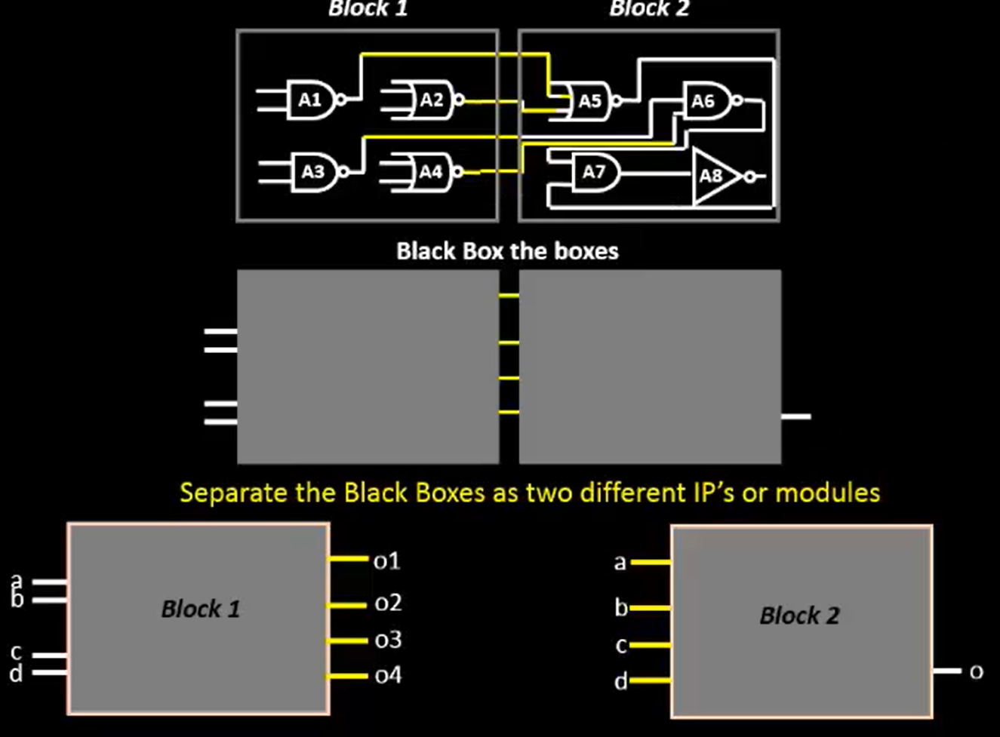

Purpose:

If a block repeats multiple times:
- Instead of showing all internal logic
- Represent as a single block

This simplifies:

- Timing analysis
- Placement
- Floorplanning

---

### 2.3 Floor Planning

Floorplanning involves:

- Arranging IP blocks
- Fixing pre-placed cells
- Assigning physical regions
- Leaving routing channels
- Defining core boundary

Automated placement & routing tools:
- Place standard cells around pre-placed macros

---

## 3. Surrounding Pre-Placed Cells with Decoupling Capacitors

### Pre-Placed Cells

Pre-placed cells (IP blocks/macros) are:

- Large blocks like Memory, Comparator, Clock gating cells, MUX etc.
- Placed before standard cell placement.
- Fixed in location.
- Not moved during placement and routing.
- Treated as black boxes.

  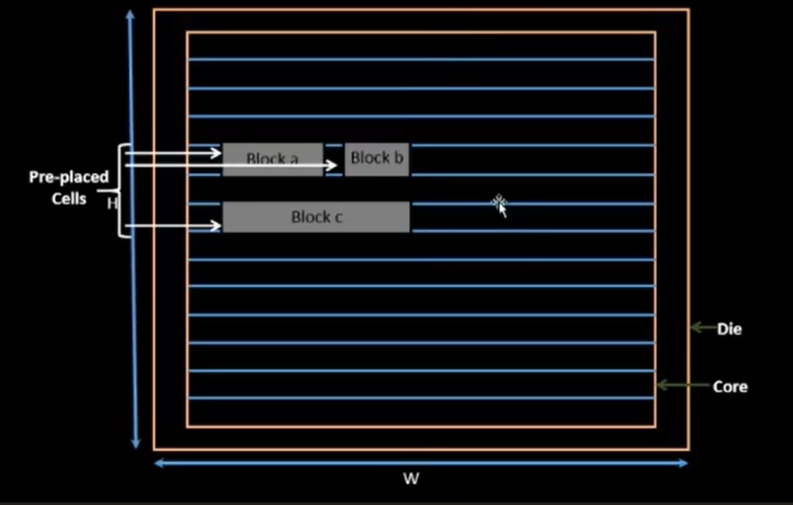

These blocks:

- May consume large switching current.
- May switch simultaneously.
- Can cause supply instability.

---


### IR Drop and Noise Margin Impact

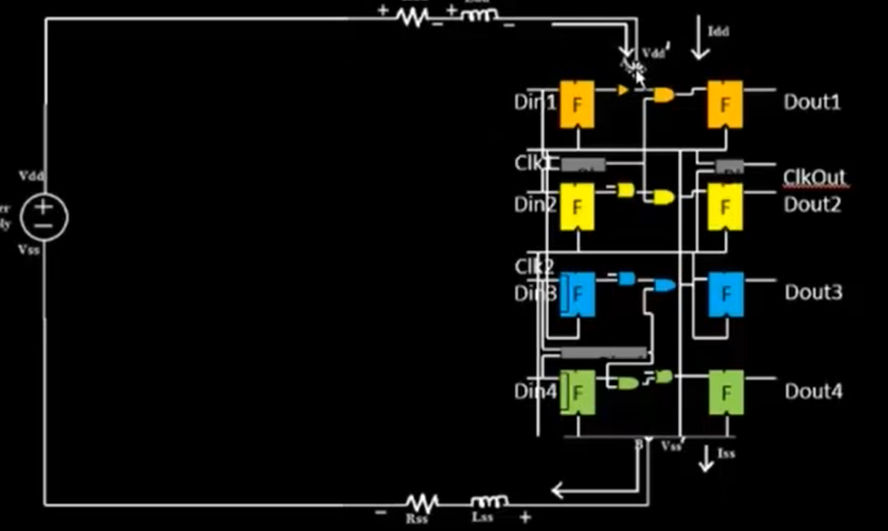

Example:

If VDD = 1V  
Due to IR drop, internal node may receive only 0.7V.

This may:

- Reduce noise margin.
- Push logic level toward undefined region.
- Cause functional failure.

---

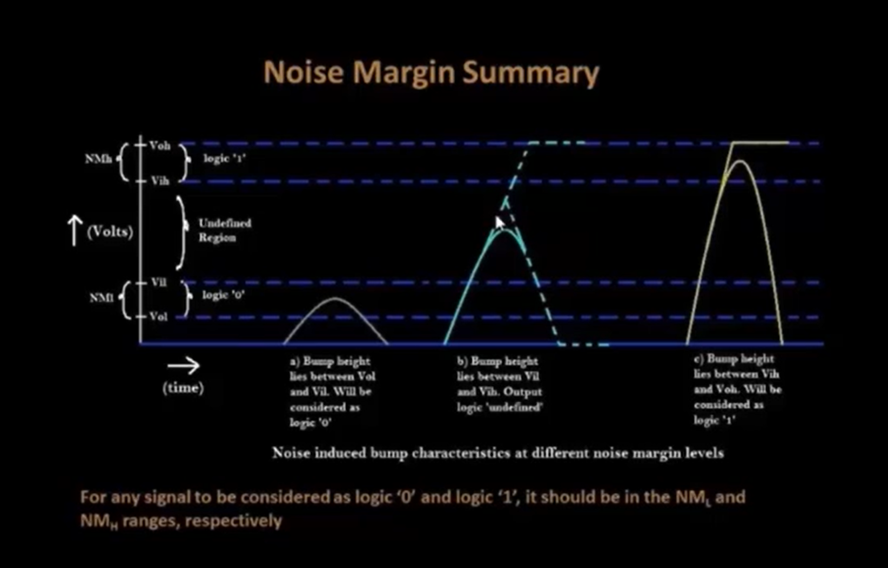

### Noise Margin and Undefined Region (Unsafe Zone)

For digital circuits, valid voltage levels are defined as:

- VOL  → Maximum voltage recognized as Logic 0
- VOH  → Minimum voltage recognized as Logic 1
- VIL  → Input voltage threshold for Logic 0
- VIH  → Input voltage threshold for Logic 1

Noise margins are defined as:

NMH = VOH − VIH  
NML = VIL − VOL  

For proper logic operation, both NMH and NML must be positive and sufficiently large.

### Undefined Region

The voltage region between VIL and VIH is called the **Undefined Region**.

This region is an **unsafe zone** because:

- The logic level is not guaranteed to be 0 or 1.
- Circuit behavior becomes unpredictable.
- Output may oscillate or produce incorrect logic.
- Functional failures may occur.

If due to IR drop or ground bounce:

- Logic High drops below VIH
- Logic Low rises above VIL

The signal may enter the undefined region.

This unsafe voltage zone must always be avoided in reliable chip design.

---

## Solution: Decoupling Capacitors (DECAP)

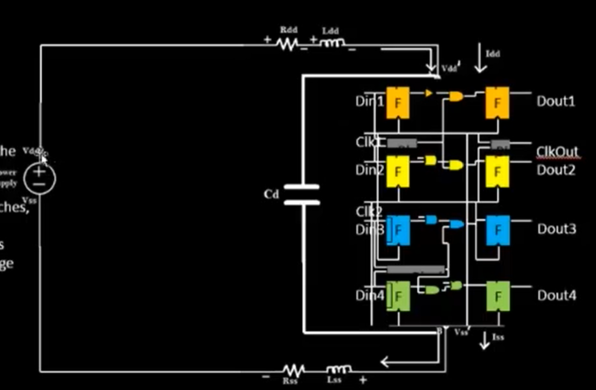

To solve supply instability:

We place decoupling capacitors near macros.

### What is a Decoupling Capacitor?

- A local capacitor placed between VDD and VSS.
- Stores charge.
- Supplies current locally during switching.
- Reduces sudden current demand from global supply.

---

## Surrounding the Pre-Placed Cells

Decoupling capacitors are placed around large IP blocks:

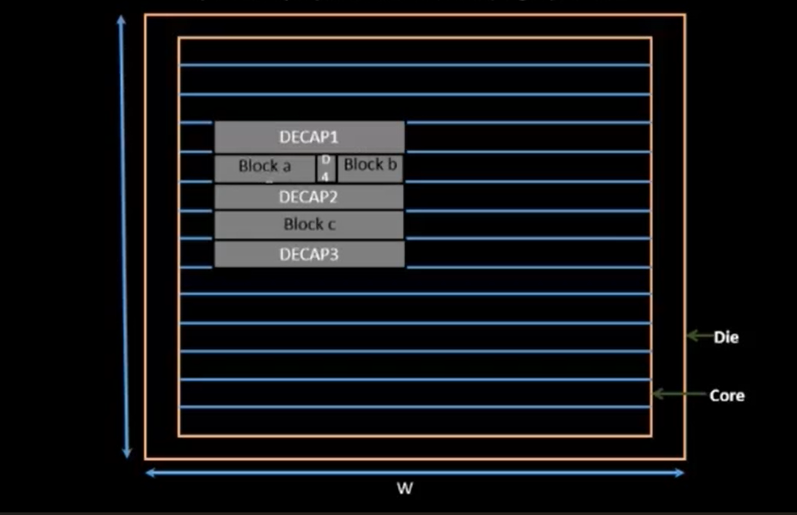

These DECAP cells are inserted:

- Around the boundary of the macro.
- Between large IP blocks.
- Near power sensitive regions.

---

## Why Surround the Pre-Placed Cells?

Because:

- Macros draw high instantaneous current.
- Long power routing introduces resistance.
- Large switching activity causes voltage fluctuations.

Decoupling capacitors:

- Provide a local charge reservoir.
- Reduce IR drop.
- Reduce ground bounce.
- Improve power integrity.
- Maintain stable VDD and VSS.
- Keep signals away from the undefined (unsafe) region.

---
## 4. Power Planning 

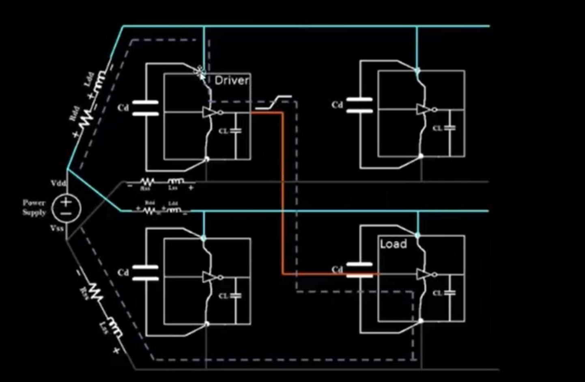

### Scenario:

If a macro is repeated many times:

- All blocks may switch simultaneously
- Large current drawn at same time
- Causes IR drop
- Causes Ground bounce

---

### Two Major Issues:

### 1) When Logic switches 1 → 0

- All capacitors discharge
- Sudden current to ground
- Causes ground bounce

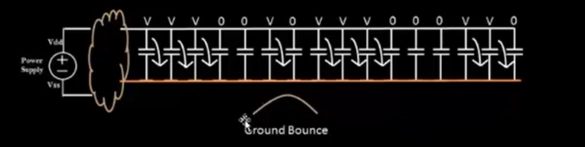

### 2) When Logic switches 0 → 1

- All capacitors charge
- Heavy current from VDD
- Causes voltage drop at VDD

 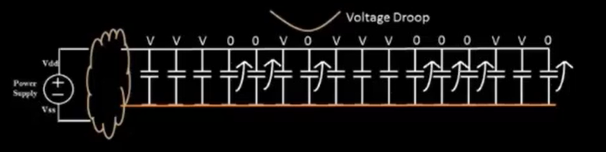

---

### Solution: Multiple Power Tap Points

Instead of:

Single VDD/VSS source

We provide:

- Multiple VDD rails
- Multiple VSS rails
- Power grid network

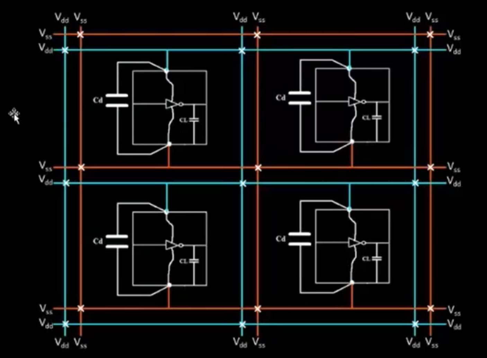

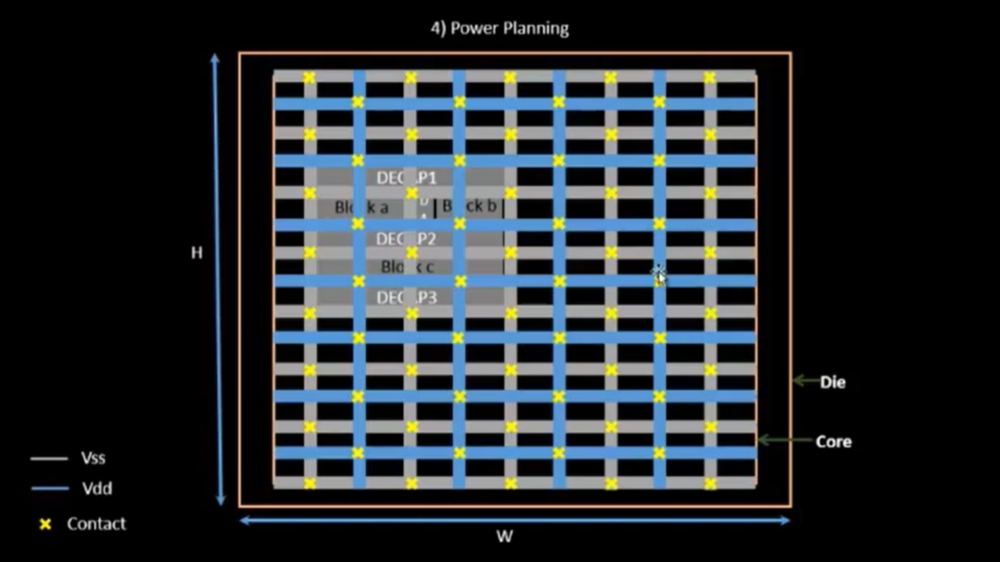

This ensures:

- Current distributed evenly
- Reduced IR drop
- Reduced ground bounce
- Stable supply


---


## 5) Pin Placement

### Complete Design

The complete design connects:

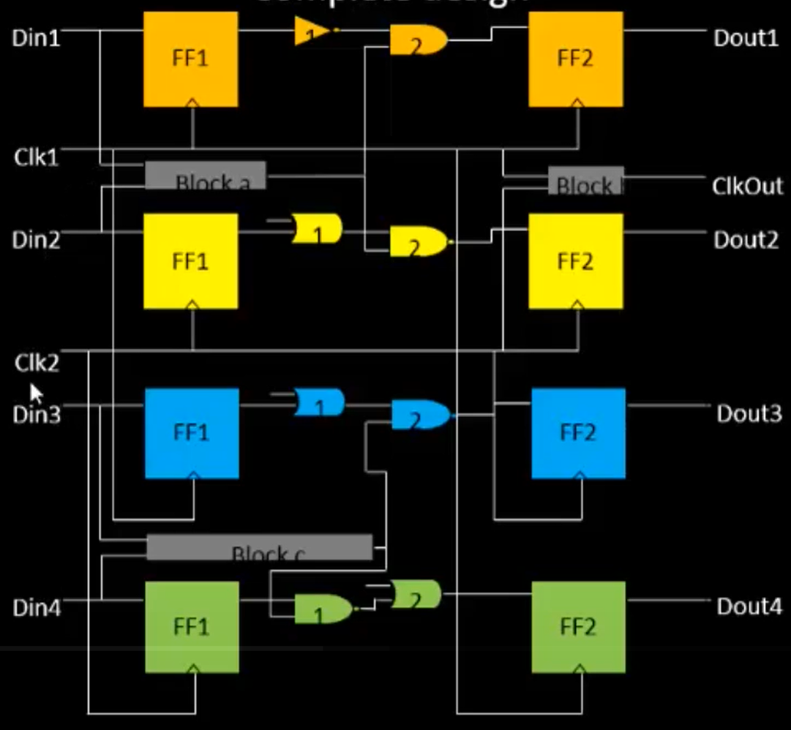

The connectivity information (how gates are connected) is coded using a hardware description language.

This connectivity description is written using **VHDL language**  
and is called the **Netlist**.

---

After floorplanning, pins are placed on the boundary of the die.

Inputs (DIN1–DIN4) and clocks (CLK1, CLK2) are placed on one side.

Outputs (DOUT1–DOUT4, CLKOUT) are placed on another side.

Pin placement is done carefully to:

- Reduce routing congestion
- Reduce wirelength
- Improve timing

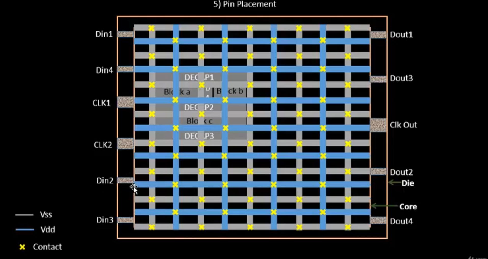

### Important Note on Clock Pins

As observed in the pin placement:

- Clock pins (CLK1, CLK2) are bigger in size.

Reason:

Clock signals drive multiple flip-flops continuously.

They require:

- Lower resistance path
- Better current handling
- Stronger metal routing

Similarly:

- CLKOUT should also have lower resistance.

Conclusion:

Bigger the pin size → Lower the resistance.

This improves clock distribution and reduces delay/skew.

---

### Placement Tool Behavior

Now once size and pin placement are defined,

Automatic routing and placement tools try to place standard cells in the available core area.

However,

Certain regions must not have standard cells placed.

---

## Logical Cell Placement Blockage

To prevent tools from placing cells in restricted areas,

We create a **Logical Cell Placement Blockage**.

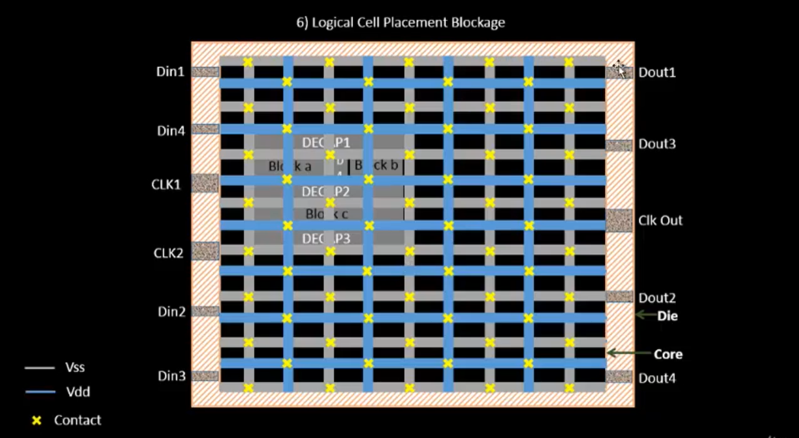

Blockage means:

- A defined region in the core
- Where placement tool is restricted
- No cell can be placed in that area

This blockage ensures:

- Space is reserved for routing
- Space is reserved for future modifications
- Macros and critical routing areas are protected
- Congestion is reduced

The placement and routing tool will not place any cell inside the blockage area.

---
</details>

---

<details>
  <summary>2.2. LAB</summary>

  ## Floor Planning:

   Command:

    run_floorplan

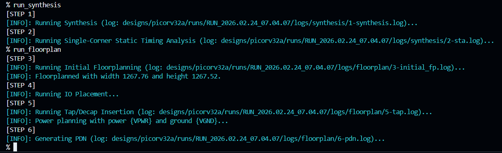

During this step:

- The chip area (die size) is calculated.

- The width and height of the design are decided.

- IO pins are placed on the boundary of the chip.

- Tap cells are inserted to prevent latch-up issues.

- Decoupling (decap) cells are inserted to reduce power noise and IR drop.

- Power planning is performed for VPWR (power) and VGND (ground).

- The Power Distribution Network (PDN) is generated.

After this step, the chip has:

- Fixed dimensions

- IO pin locations

- Power grid

- Prepared rows for standard cell placement

### Config.tcl

`config.tcl` controls how the chip is built.

It decides:
- How big the chip will be
- How much area is used by logic cells
- The shape of the chip
- The target operating frequency
- How the floorplanning stage should behave

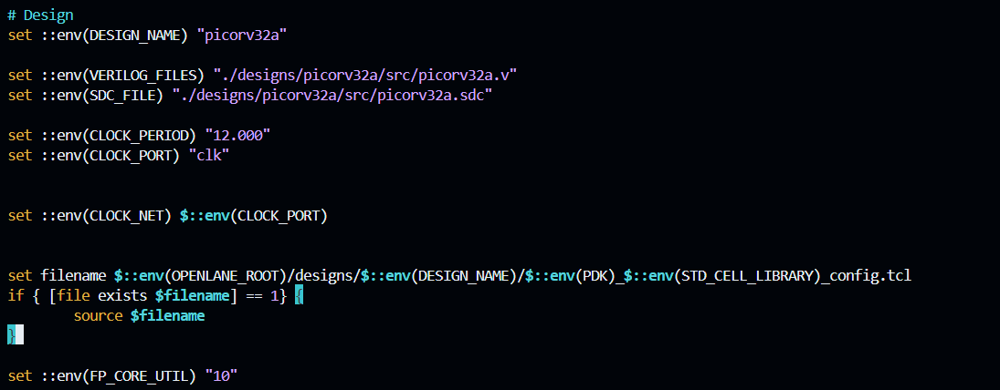

With this config.tcl we will get floorplanning output as:


- `FP_ASPECT_RATIO = 1`  
  Sets the chip shape to square (width ≈ height).

- `FP_CORE_UTIL = 10`  
  Sets core utilization to 10%.  
  Only 10% of the core area is used for logic cells, making the chip area larger.

  This is the def file for this config.tcl

  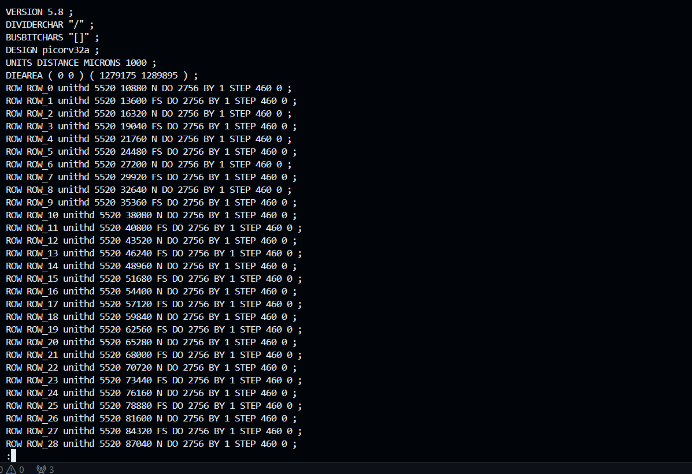
### Creating sky130A_sky130_fd_sc_hd_config.tcl file inside picorv32a directory:
This file overrides the default core utilization value specifically for the sky130A PDK and sky130_fd_sc_hd standard cell library.

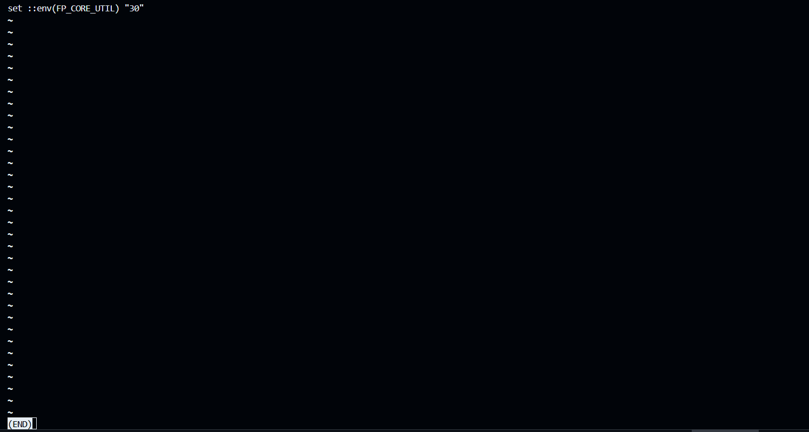

### Modified config.tcl
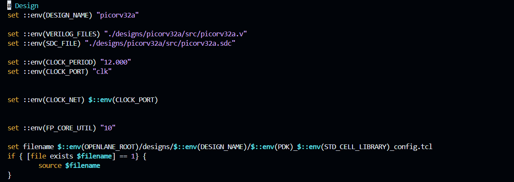


After creating the new configuration file and updating config.tcl, the floorplanning stage is executed again.

### Floorplan Output

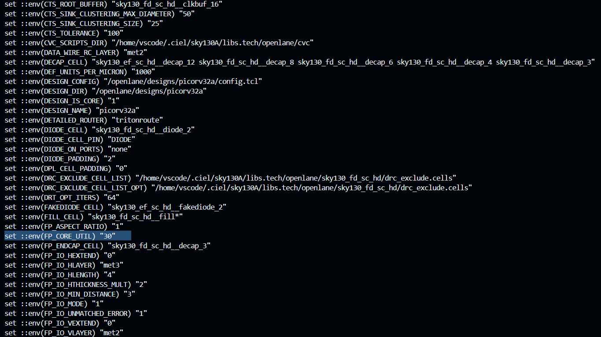

  picorv32a.def after adding the sky130A_sky130_fd_sc_hd_config.tcl file

  The def file is in:

  
   Command:

    /home/vscode/Desktop/OpenLane/designs/picorv32a/runs/RUN_2026.02.25_01.46.35/results/floorplan/picorv32a.def


  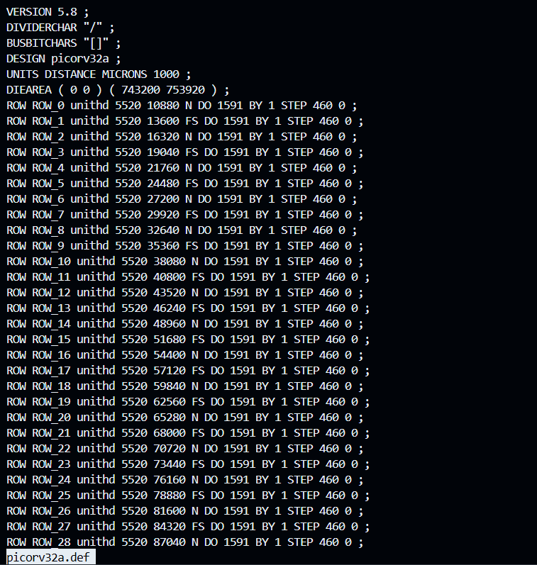

## Effect of the Modification

### Previous Configuration

- Core Utilization = 10%
- Chip area was larger
- More unused white space inside the core
- Lower routing congestion

### After Modification

- Core Utilization = 30%
- More standard cells are packed inside the core
- Chip area becomes smaller compared to 10% utilization
- Routing density increases moderately
- Area utilization becomes more efficient

## What Happens After Adding sky130A_sky130_fd_sc_hd_config.tcl

After adding the file `sky130A_sky130_fd_sc_hd_config.tcl`, OpenLane reads this file automatically during the flow.

This file overrides the default configuration for the sky130A PDK and sky130_fd_sc_hd standard cell library.

As a result:

- The new core utilization value (30%) is applied.
- Floorplanning is recalculated using the updated value.
- The chip area is reduced compared to 10% utilization.
- Standard cells are placed more compactly.
- Overall area usage becomes more efficient.

## Viewing Floorplan Layout in Magic using this commands

```bash
cd /home/vscode/Desktop/OpenLane/designs/picorv32a/runs/RUN_2026.02.25_01.46.35

magic -T ~/.ciel/sky130A/libs.tech/magic/sky130A.tech lef read tmp/merged.nom.lef def read results/floorplan/picorv32a.def &


  ```
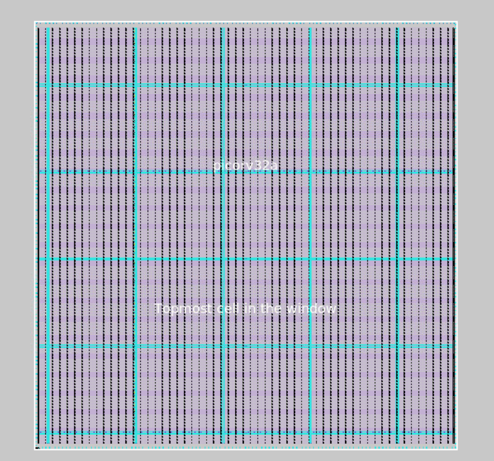
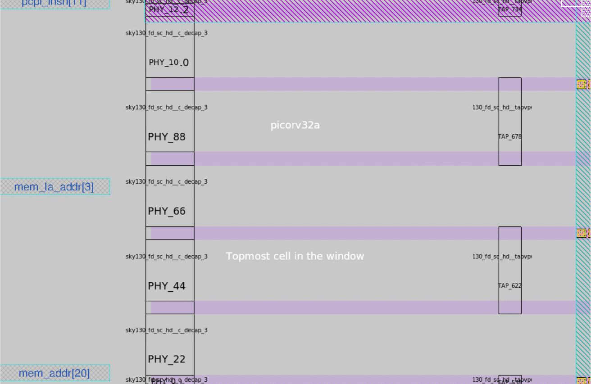
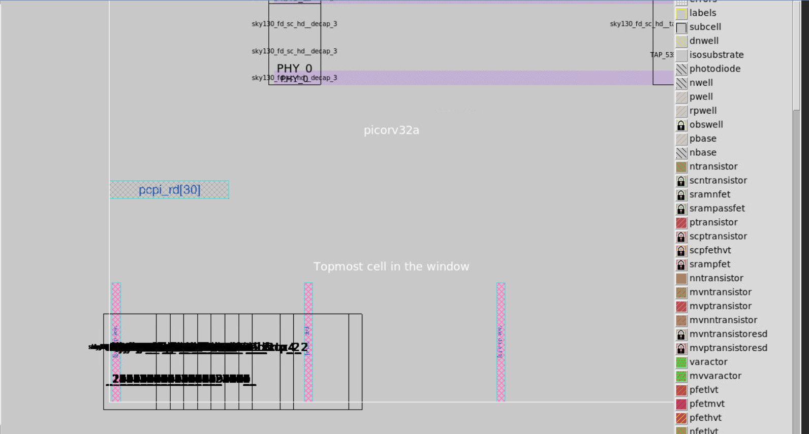

## Basic Magic Layout Viewing Commands

- Press `v` to fit the entire layout to the screen.

- To zoom into a specific area:
  - Left click 
  - Right click to form a bounding box.
  - Press `Ctrl + Z` to zoom into the selected area.

- To select a specific object:
  - Place the mouse pointer over the object.
  - Press `s` to select it.
  - In the `tkcon` window, type:
    ```
    what
    ```
    to view the details of the selected object.

    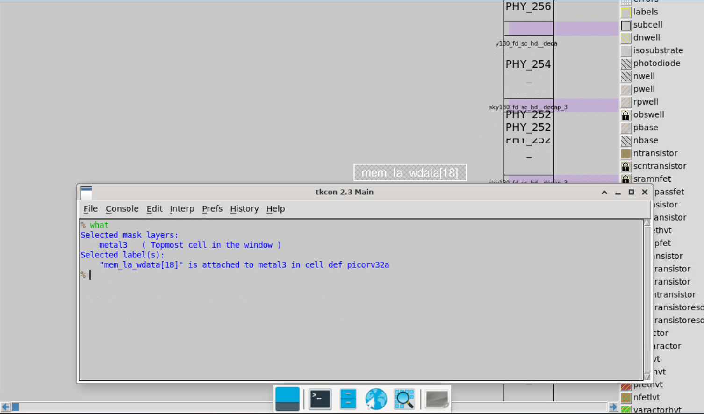
</details>
  
</details>

<details>
<summary><strong>Phase 3 - Timing Literacy with Ideal Clocks</strong></summary>
  
---

 <details><summary>3.1. Theory</summary>


## 1. Introduction to Setup Timing

Timing analysis is performed using an **ideal clock** (before clock tree is built).

We consider:

- Launch Flip-Flop
- Combinational Logic
- Capture Flip-Flop

Clock is assumed ideal (no clock tree delay).

---

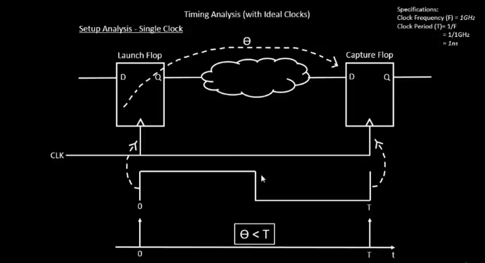

## 2. Basic Setup Timing Condition

At time t = 0  
Clock edge reaches the **launch flip-flop**.

At time t = T  
Next clock edge reaches the **capture flip-flop**.

Let:

Θ = Total combinational delay between launch and capture FF  
T = Clock period  

For correct operation:

Θ < T

If Θ exceeds T:

- Clock period must be increased  
- Frequency decreases  

---

## 3. Practical Scenario – Flip-Flop Structure

A flip-flop is not a simple black box.  
It contains:

- MUX1
- MUX2
- Several internal logic gates

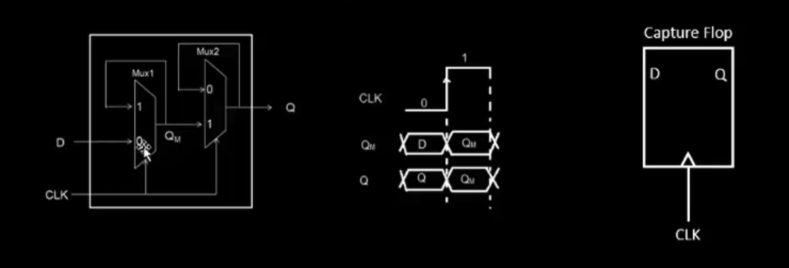

When:

CLK = 0  
- Data propagates inside first stage  
- Output remains stable  

CLK transitions 0 → 1  
- Data is captured  
- Output changes  

Because flip-flop is built using logic gates and multiplexers:

Internal delays exist.

This creates a **setup time requirement**.

---

## 4. Setup Time Consideration

The capture flip-flop needs finite time to settle.

Let:

S = Setup time  

Effective timing condition becomes:

Θ < (T - S)

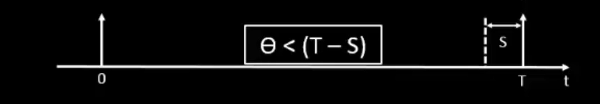

So available time reduces.

---

## 5. Introduction to Clock Jitter

Clock edges are ideally expected at:

0, T, 2T, 3T, ...

However, due to circuit variations:

- Clock edge may arrive slightly earlier or later
- This variation is called **Clock Jitter**

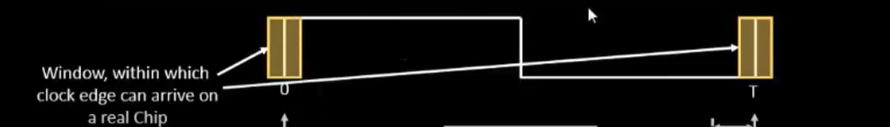

Clock jitter = temporary variation of clock period.

Cause:
- Clock source circuitry variation
- Environmental and internal variations

---

## 6. Introducing Clock Uncertainty

All clock variations are represented as a single parameter:

Clock Uncertainty (δU)

New timing equation becomes:

Θ < (T - S - δU)

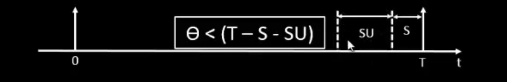

Where:

- Θ = Combinational delay
- S = Setup time
- δU = Clock uncertainty

---

## 7. Example Calculation

Assume:

T = 1 ns  
S = 0.01 ns  
Uncertainty = 0.09 ns  

Then:

Θ < (1 - 0.01 - 0.09)

Θ < 0.9 ns

So maximum allowed combinational delay = 0.9 ns.

---

## 8. Complete Timing Path Expression

Total delay (Θ) includes:

- Clock to Q delay of launch flip-flop
- Delay of combinational logic block 1
- Delay of combinational logic block 2
- Additional gate delays

General form:

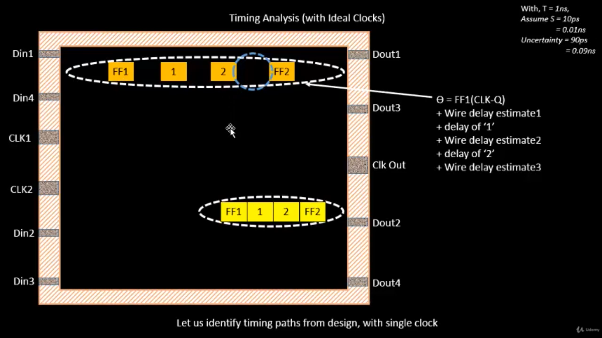
Θ = FF1 (Clock-to-Q delay)
    + wire delay estimate 1
    + Delay of gate 1
    + wire delay estimate 2
    + Delay of gate 2
    + wire delay estimate 3

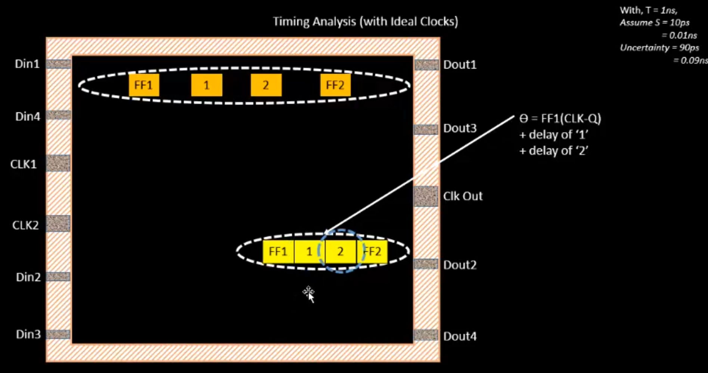

Θ = FF1 (Clock-to-Q delay)
    + Delay of gate 1
    + Delay of gate 2

Final condition:

Θ < (T - S - δU)

If this condition satisfies → setup timing is met.

If not → timing violation occurs.

---

## 9. Summary

Initial condition:
Θ < T

With setup time:
Θ < (T - S)

With setup time + uncertainty:
Θ < (T - S - δU)

This is the complete setup timing condition used in OpenSTA analysis.
   
 </details>
 
 ---

 <details><summary>3.2. LAB</summary>

##  Objective

To perform Static Timing Analysis (STA) on the synthesized netlist of the `picorv32a` design using OpenSTA and to analyze setup and hold timing behavior under worst-case PVT corners.

---


The RTL (`picorv32a.v`) was synthesized using OpenLane.
The synthesized gate-level netlist was generated inside:

```
results/synthesis/picorv32a.v
```

A custom `pre_sta.conf` file was created to perform static timing analysis.

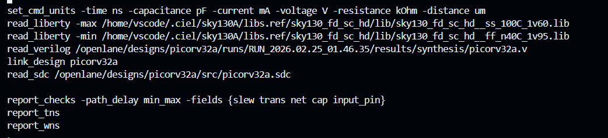

The following PVT corners were selected:

- Setup (MAX delay) → `ss_100C_1v60`
- Hold (MIN delay) → `ff_n40C_1v95`

This is the path to get the lib files

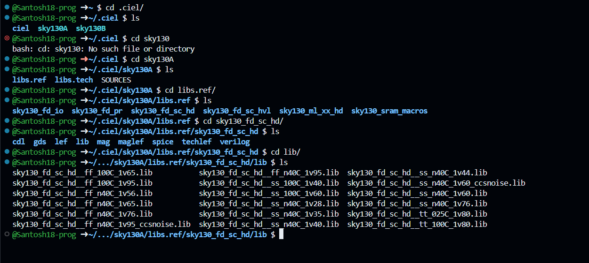

This corresponds to:

- Slow process, high temperature, low voltage → worst-case setup
- Fast process, low temperature, high voltage → worst-case hold

---

The STA was executed using:

```bash
sta pre_sta.conf
```
## RESULT

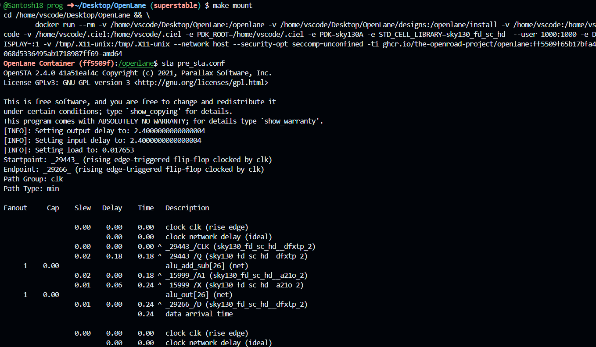
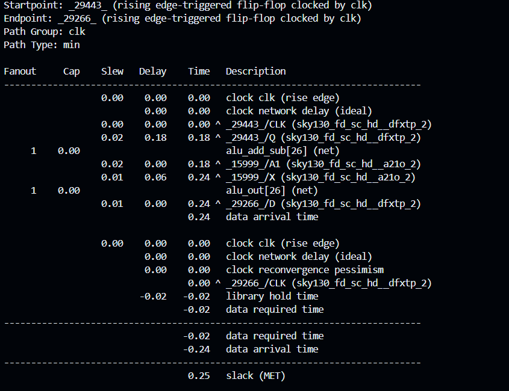
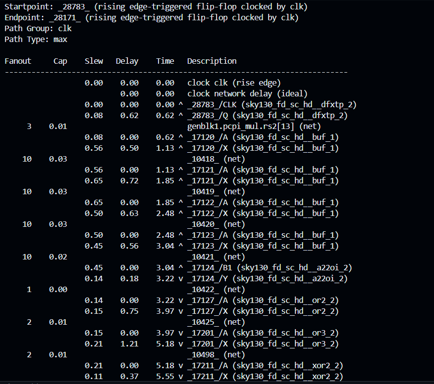
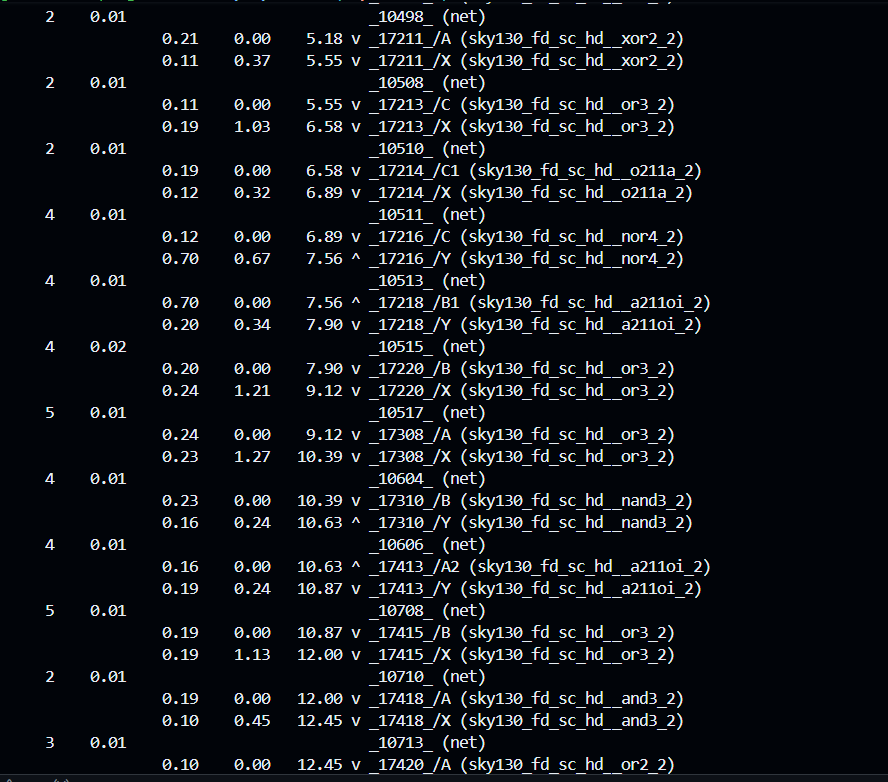
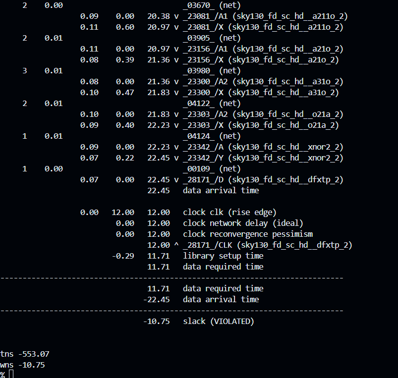

##  Results Observed

###  Setup Timing (MAX Path)

- Data Arrival Time = 22.45 ns
- Data Required Time = 11.71 ns
- Slack = -10.75 ns (VIOLATED)

WNS = -10.75 ns  
TNS = -553.07 ns  

This indicates significant setup timing violation.

---

###  Hold Timing (MIN Path)

- Slack = +0.25 ns (MET)

Hold timing is satisfied.

---


## 7️ High Fanout Observation

During analysis, several high fanout nets were observed (fanout 10, 6, 5).

High fanout causes:

- Increased capacitive loading
- Higher RC delay
- Slower signal transition
- Increased data arrival time

This contributes to the setup timing violation.

---

##  Conclusion

- Setup timing is violated at synthesis level.
- Hold timing is satisfied.
- The violation is due to large combinational delay relative to the 12 ns clock period.
- High fanout nets significantly impact delay.

   
 </details>
</details>
## 🛠 Tools Used

| Stage | Tool |
|-------|------|
| Synthesis | Yosys |
| Floorplan & Placement | OpenROAD |
| Routing | OpenROAD |
| DRC | Magic |
| LVS | Netgen |
| STA | OpenSTA |
| Flow Automation | OpenLANE |
| PDK | Sky130 |

---

## 📂 Repository Structure

```
.
├── images/
└── README.md
```

---

## 🎯 Learning Outcomes

- Complete ASIC Backend Flow understanding  
- Timing closure concepts  
- Power planning basics  
- DRC & LVS debugging  
- Antenna rule fixing techniques  

---
